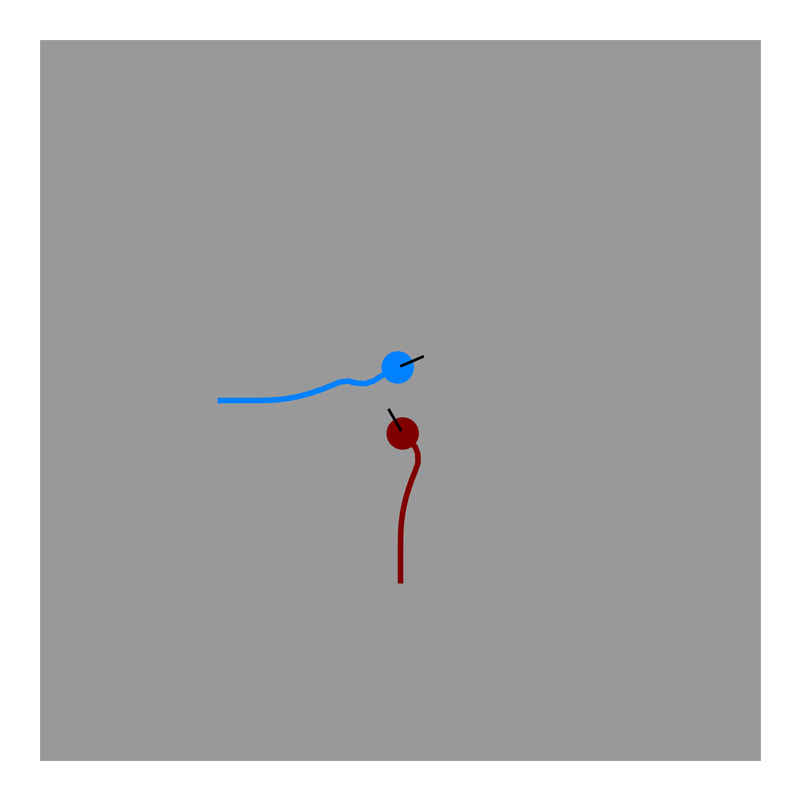
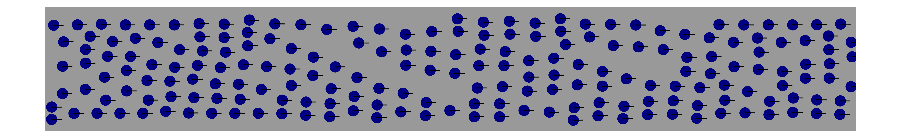
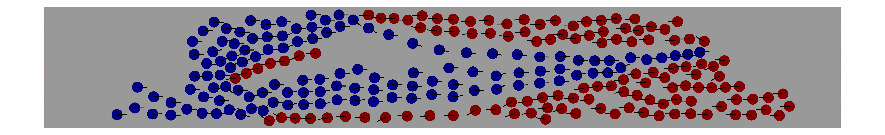
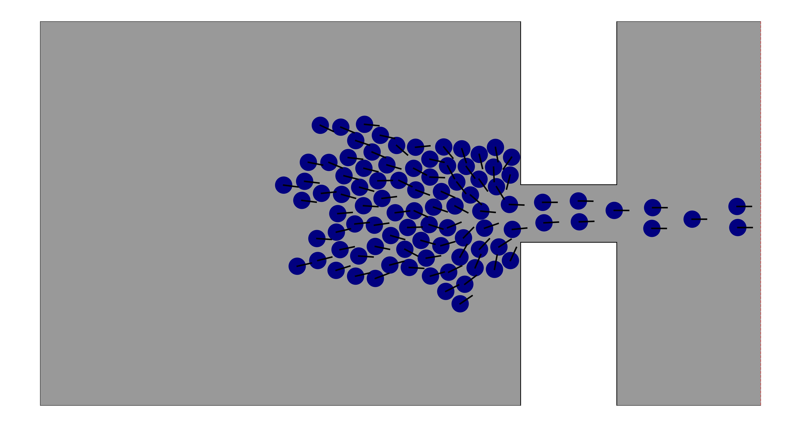
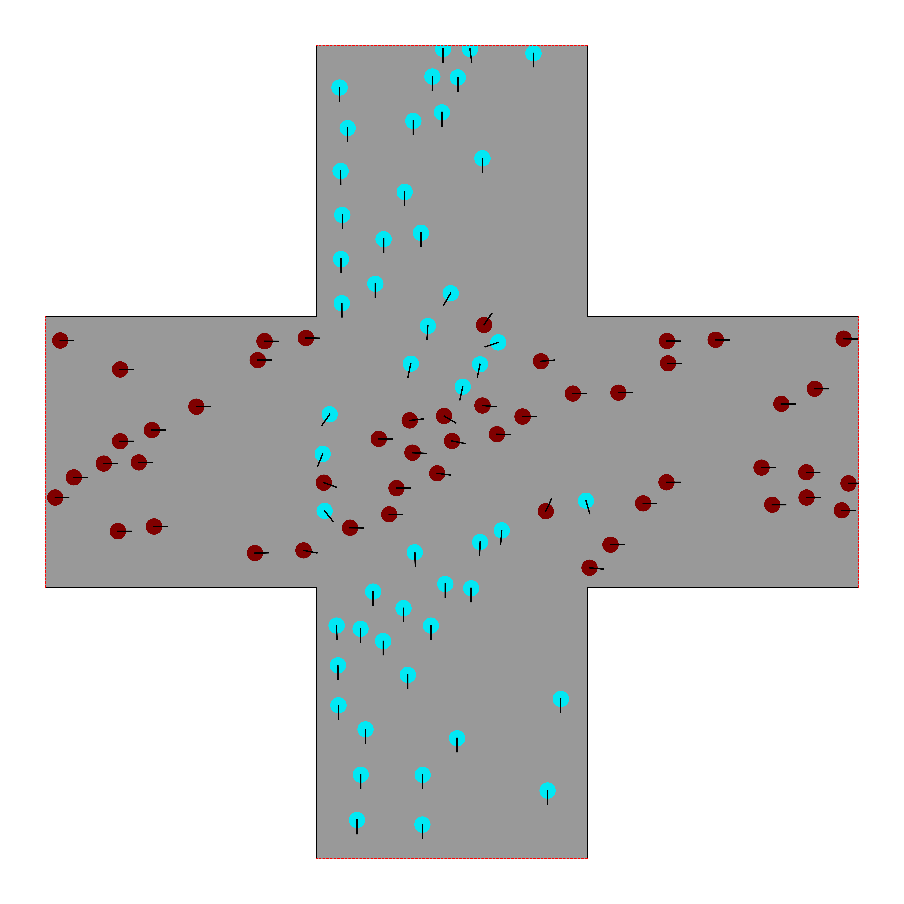
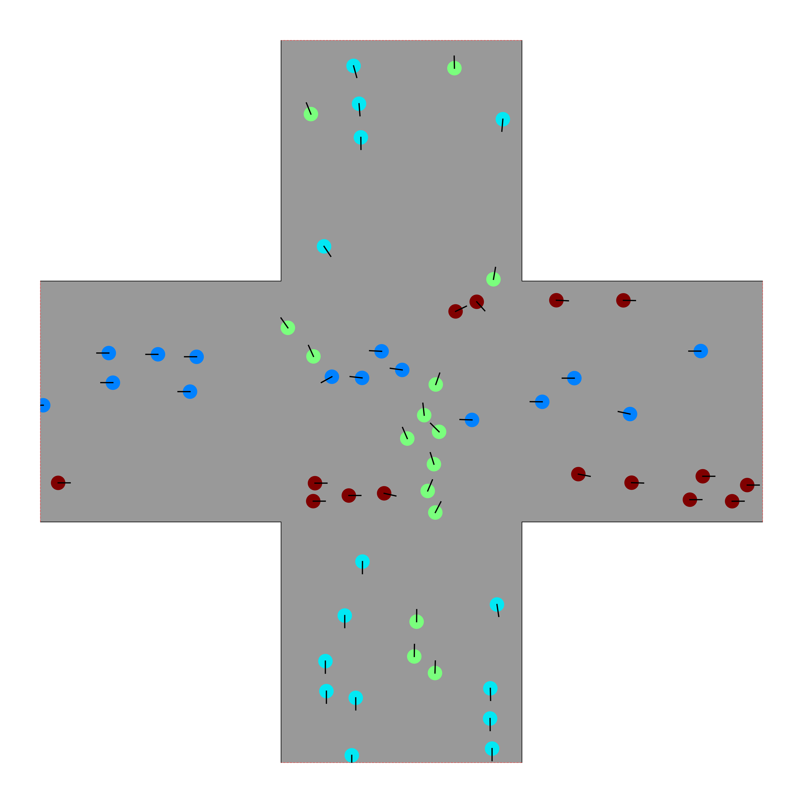

[](https://raw.githubusercontent.com/JuPedSim/jpscore/master/LICENSE)

## Introduction

**jpscore** is the core module of [jupedsim](https://www.jupedsim.org/jupedsim_introduction.html) for preforming the simulation (i.e. computing the trajectories).  
This branch is used to demonstrate the work of paper [Anticipation in velocity-based model for pedestrian dynamics](https://arxiv.org/abs/2107.00624).  
The implementation of  the **anticipation velocity model (AVM)** can be found in [AVMModel.cpp](https://github.com/xuqiancheng/jpscore/blob/AnticipationVelocityModel/math/AVMModel.cpp).  
For more information about jupedsim, see [documentation](https://www.jupedsim.org/). 

## Installation

See [Build jupedsim from source](https://www.jupedsim.org/jupedsim_requirements.html) for reference.  
Contact q.xu@fz-juelich.de if you meet any problems.

## Quick start

See [Getting started with jupedsim](http://www.jupedsim.org/jpscore_introduction.html).

## Parameters setting

Please read this paper first: [Anticipation in velocity-based model for pedestrian dynamics](https://arxiv.org/abs/2107.00624).  
The parameters of simulations are set in the inifile.xml, see [example](https://github.com/xuqiancheng/jpscore/blob/AnticipationVelocityModel/demos/scenario_1_binary_unidirectional/inifile.xml).  
The meaning of each parameter can be found in [jpscore inifile](https://www.jupedsim.org/jpscore_inifile.html).  
For the parameters of the AVM.   

```
<model_parameters>
    <model_type using="2" />                        
    <force_ped D="0.01" a="6.0" />                
    <force_wall D="0.05" a="6" />                 
    <GCVM Td="0.3" Ts="0.5" />                      
    <AVM AntiTime="1.0" ConstantAlpha="false"/>   
</model_parameters>
```
- model_type using:  **0** means using the CSM, **1** means using the GCVM, **2** means using the AVM.
+ force_ped:
	- D: the parameter used to calibrate the range of impact from neighbours. corresponding to  in [equation (3)](https://arxiv.org/pdf/2107.00624.pdf). 
	- a: the parameter used to calibrate the strength of impact from neighbours. Corresponding to  in [equation (4)](https://arxiv.org/pdf/2107.00624.pdf).
+ force_wall:
	- D: the parameter used to calibrate the range of impact from walls.  
	- a: the parameter used to calibrate the strength of impact from walls.
+ GCVM:
	- Td: the relaxation parameter adjusting the rate of the turning process. Corresponding to  in [equation (7)](https://arxiv.org/pdf/2107.00624.pdf).
	- Ts: the slope of the speed-headway relationship. Corresponding to  in [equation (10)](https://arxiv.org/pdf/2107.00624.pdf).	
+ AVM:
	- AntiTime: the prediction time. Corresponding to  in [equation (2)](https://arxiv.org/pdf/2107.00624.pdf).
	- ConstantAlpha: **true** means using constant  in [equation (4)](https://arxiv.org/pdf/2107.00624.pdf), **false** means using dynamic  in [equation (4)](https://arxiv.org/pdf/2107.00624.pdf).


## Demos

The following demos are provided for testing. They can be found in [demos](https://github.com/xuqiancheng/jpscore/tree/AnticipationVelocityModel/demos).

- scenario_1_binary_unidirectional  
  One agent moves behind another.  
  <a href="https://www.youtube.com/watch?v=bQf1JVLLKvA
  " target="_blank"></a>  

- scenario_2_binary_counter  
  Two agents move toward each other.  
  <a href="https://www.youtube.com/watch?v=enKuC2DhCCI
  " target="_blank"></a>  

- scenario_3_binary_cross  
  Two agents move across each other's path.  
  <a href="https://www.youtube.com/watch?v=IStIh0dlqtU
  " target="_blank"></a>  

- scenario_4_crowd_unidirectional  
  200 agents move toward the same direction in a corridor (length: 26 meters, width: 4 meters) with periodic boundary conditions.  
  <a href="https://www.youtube.com/watch?v=-rLlQpQbkOU
  " target="_blank"></a>  

- scenario_5_crowd_counter  
  Two groups of agents (120 in each) move toward others in a corridor (length: 26 meters, width: 4 meters) with periodic boundary conditions.   
  <a href="https://www.youtube.com/watch?v=KzC-ngEtn5I&t=69s
  " target="_blank"></a>  
  
- scenario_6_crowd_bottleneck  
  100 agents move through a bottleneck (1.2-meter wide).  
  <a href="https://www.youtube.com/watch?v=-k2Jv2bMSFM
  " target="_blank"></a>  
  
- scenario_7_crowd_cross_twoDirection  
  Two groups of agents (50 in each) from two directions move in a cross scenario (6-meter wide) with periodic boundary conditions.  
  <a href="https://www.youtube.com/watch?v=-5N66x4qFGM
  " target="_blank"></a>  
  
- scenario_8_crowd_cross_fourDirection  
  Four groups of agents (15 in each) from four directions move in a cross scenario (6-meter wide) with periodic boundary conditions.  
  <a href="https://www.youtube.com/watch?v=iQsMnU-ByT4
  " target="_blank"></a>  

## Support

We are heavily working on this project which means that:

- It's not done. We will be releasing new enhancements, bug fixes etc.
- We love your support. If you find any errors or have suggestions, please write an issue in our [issue-tracker](https://github.com/JuPedSim/jpscore/issues). We will try hard to fix it.
- Be patient. We are scientists and PhD/master students. Therefore, we primarily care about our research and theses.

If you meet any problems with this branch or the anticipation velocity model, feel free to contact q.xu@fz-juelich.de.

Enjoy!

